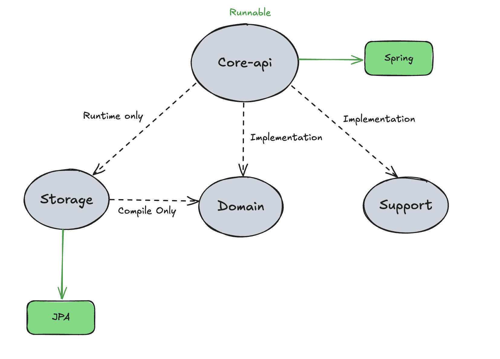

# Kotlin SpringBoot Multi Module

This project provides a foundational structure for a Kotlin Spring Boot multi-module setup. 

While it may not represent the most advanced architecture, it is a good starting point for projects where initial productivity is a priority.

As your software evolves and scales, the structure can and should adapt accordingly.

# Module

## Core-api

This is the only executable module in the project. 

It contains the API-related logic, including Controller classes, and is designed to maximize development productivity during the early stages of the project.

## domain

This module handles domain models and business logic. It centralizes the core functionality and logic of the application to maintain modularity and separation of concerns.

## storage

Submodule: This module is responsible for database-related operations and integrations.

### storage:db-core

An example submodule demonstrating integration with an H2 database using Spring Data JPA. It serves as a template for implementing other database or storage solutions.

## Support

Submodule: This module contains auxiliary features such as logging and monitoring.

### support:logging

Handles application logging. This module can be customized to integrate different logging frameworks or configurations.

### support:monitoring

Provides monitoring capabilities for the application, ensuring observability and performance tracking.

## Reference

> Here are the references and videos used when designing this project.

* [Github: spring-boot-kotlin-template](https://github.com/team-dodn/spring-boot-kotlin-template)

* [토스ㅣSLASH 22 - 지속 성장 가능한 코드를 만들어가는 방법](https://www.youtube.com/watch?v=RVO02Z1dLF8&ab_channel=토스)

* [지속 성장 가능한 소프트웨어를 만들어가는 방법](https://www.youtube.com/watch?v=pimYIfXCUe8&ab_channel=제미니의개발실무)

* [모듈 분리 시 의존 관계 설정](https://www.youtube.com/watch?v=nVGV8ag8v7g&ab_channel=제미니의개발실무)